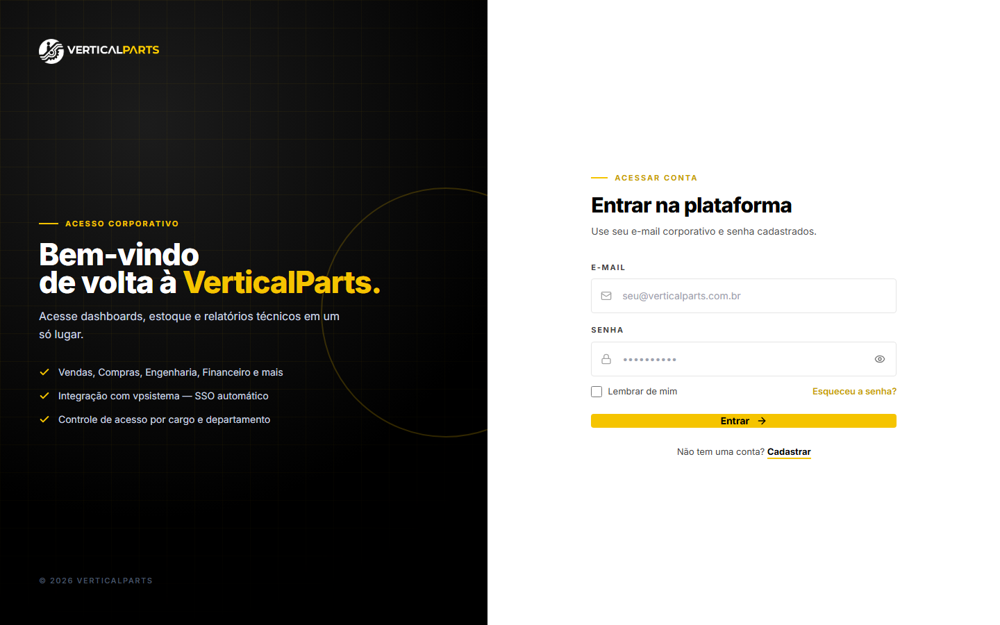
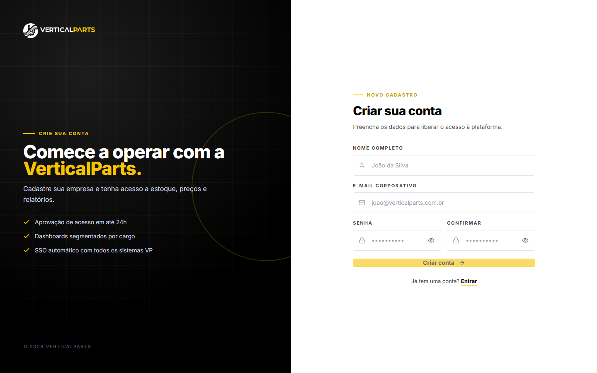
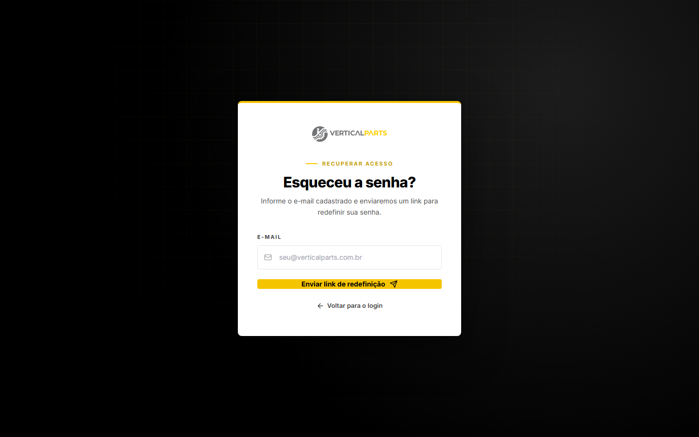
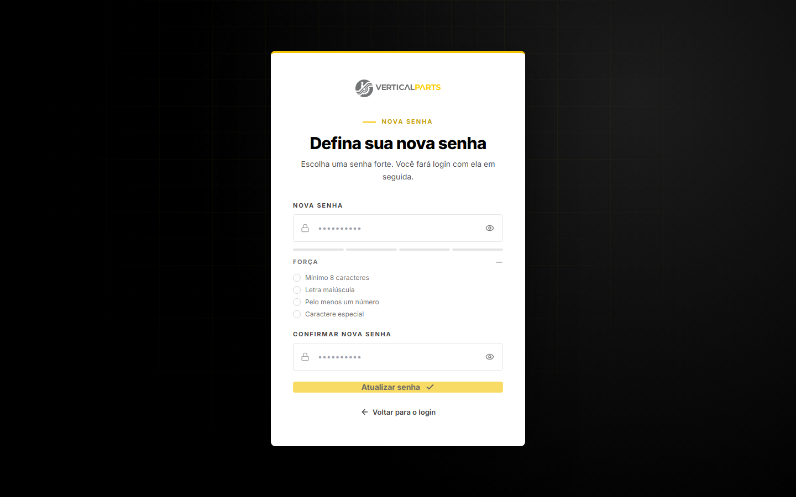
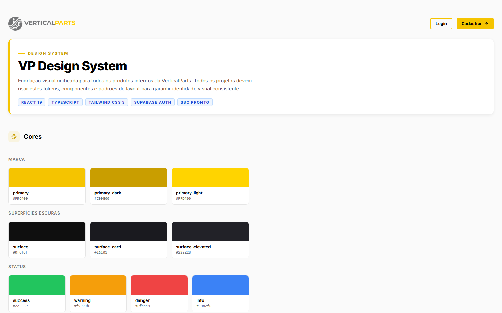
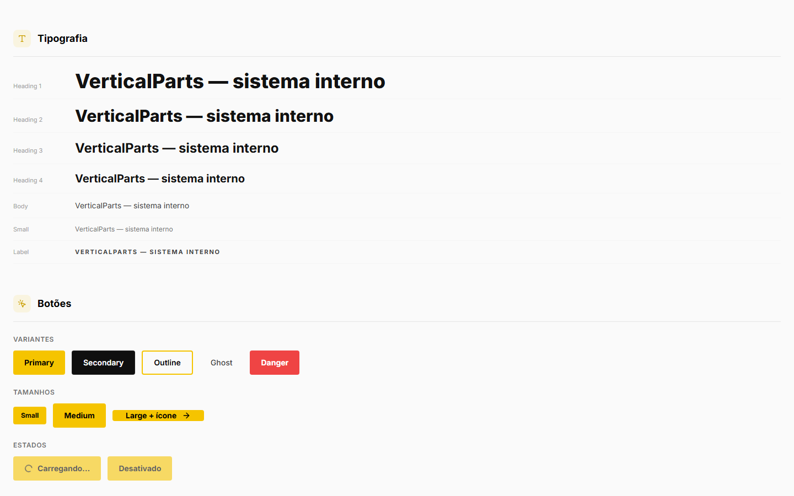
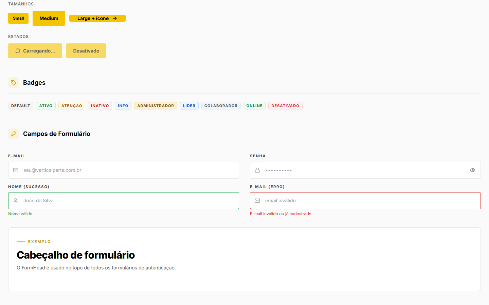

<p align="center">
  
</p>

<h1 align="center">VP Design System</h1>

<p align="center">
  Fundação visual unificada para todos os produtos internos da <strong>VerticalParts</strong>.<br/>
  Todo novo projeto deve ser iniciado a partir deste repositório.
</p>

<p align="center">
  
  
  
  
  
</p>

---

## O que é isso?

Este repositório é o **ponto de partida obrigatório** para qualquer novo sistema interno da VerticalParts. Ele entrega:

- **Identidade visual consistente** — cor `#F5C400` (dourado oficial), tipografia Poppins, espaçamentos e sombras padronizados
- **Autenticação real** — Supabase Auth com email/senha + SSO automático via `vpsistema`
- **Biblioteca de componentes** — Button, Badge, Card, KpiCard, Field, FormHead, AppShell, Sidebar prontos
- **Layouts de autenticação** — SplitShell (login/cadastro) e CenteredShell (recuperar/redefinir senha)
- **Catálogo visual interativo** — acesse `/showcase` para ver todos os componentes em uso

---

## ⚠️ Antes de começar: este site vai ter card no vpsistema.com?

Todo projeto novo criado a partir deste template precisa responder essa pergunta **antes** de qualquer código:

> **Este site vai precisar de um card em vpsistema.com** (usuário entra por vpsistema.com, vê o card e clica para acessar via SSO) **ou vai ter endereço próprio** (usuário acessa direto, sem passar pelo vpsistema)?

- **Se for card no vpsistema** → o login principal é SSO automático (`signInWithSSO`, já pronto neste template) e é preciso cadastrar o site na tabela `modules` do Supabase do `001_vpsistema`.
- **Se for endereço próprio** → login normal por email/senha (`signIn`), sem cadastro nenhum no vpsistema.

Se você é uma IA lendo esta documentação para iniciar um projeto: **pergunte isso ao usuário antes de prosseguir**. Instruções completas de cada caminho estão em [`CLAUDE.md`](./CLAUDE.md).

---

## Início rápido

```bash
# 1. Clone como base do novo projeto
git clone https://github.com/verticalpartsIA/vp-design-system.git meu-projeto
cd meu-projeto

# 2. Instale as dependências
npm install

# 3. Configure as variáveis de ambiente
cp .env.example .env
# Edite .env com as chaves do Supabase do novo projeto

# 4. Inicie o servidor de desenvolvimento
npm run dev
```

Acesse:
- `http://localhost:5173/showcase` — catálogo de componentes
- `http://localhost:5173/login` — tela de login
- `http://localhost:5173/register` — tela de cadastro

---

## Telas

### Login
> Layout dividido: painel escuro (marca) + formulário branco. Detecta SSO automático do `vpsistema`.


### Cadastro


### Recuperar senha


### Redefinir senha
> Inclui medidor de força de senha e validação em tempo real.



### Catálogo de Componentes — Cores e Tipografia


### Catálogo de Componentes — Botões, Badges e Campos


### Catálogo de Componentes — KPI Cards e Formulários


---

## Stack

| Tecnologia       | Versão | Função                              |
|------------------|--------|-------------------------------------|
| React            | 19     | Interface de usuário                |
| TypeScript       | 5.8    | Tipagem estática                    |
| Vite             | 8      | Build e servidor de desenvolvimento |
| Tailwind CSS     | 3.4    | Design tokens + classes utilitárias |
| React Router     | 7      | Roteamento client-side              |
| Supabase JS      | 2      | Autenticação real (email/senha + SSO) |
| lucide-react     | 1.7    | Ícones                              |

---

## Estrutura do projeto

```
src/
├── tokens/
│   └── tokens.ts              ← Design tokens (cores, tipografia, sombras, raios)
│
├── lib/
│   ├── supabase.ts            ← Cliente Supabase (lê VITE_SUPABASE_URL e VITE_SUPABASE_ANON_KEY)
│   ├── auth.tsx               ← AuthProvider: signIn, signInWithSSO, signOut, fetchProfile
│   └── utils.ts               ← Utilitário cn() para combinar classes Tailwind
│
├── components/
│   ├── brand/
│   │   └── Logo.tsx           ← Logo VerticalParts (variantes dark/light, tamanhos sm/md/lg)
│   │
│   ├── auth/
│   │   ├── SplitShell.tsx     ← Layout dividido escuro/branco (login e cadastro)
│   │   ├── CenteredShell.tsx  ← Layout card centralizado sobre fundo escuro (recuperar senha)
│   │   ├── Field.tsx          ← Campo de formulário com label, ícone, toggle de senha e estados
│   │   └── FormHead.tsx       ← Cabeçalho padrão dos formulários de auth
│   │
│   ├── ui/
│   │   ├── Button.tsx         ← Botão: 5 variantes × 3 tamanhos + loading + ícones
│   │   ├── Badge.tsx          ← Badge: 10 variantes (default, success, warning, danger, admin…)
│   │   ├── Card.tsx           ← Card: tema light/dark + composição com CardHeader, CardTitle
│   │   └── KpiCard.tsx        ← Card de KPI com ícone, cor, label, valor e subtexto
│   │
│   └── app/
│       ├── AppShell.tsx       ← Shell principal: Sidebar + Topbar + área de conteúdo
│       ├── Sidebar.tsx        ← Sidebar escura colapsável com navlinks e badge do usuário
│       └── Topbar.tsx         ← Barra superior com título da página e área de ações
│
└── pages/
    ├── LoginPage.tsx          ← Login email/senha + detecção de SSO automático
    ├── RegisterPage.tsx       ← Cadastro com validação e medidor de senha
    ├── ForgotPasswordPage.tsx ← Solicitar link de redefinição via Supabase
    ├── ResetPasswordPage.tsx  ← Redefinir senha com medidor de força
    ├── DashboardPage.tsx      ← Exemplo de rota protegida com AppShell
    └── ShowcasePage.tsx       ← Catálogo visual de todos os componentes
```

---

## Design Tokens

Definidos em `src/tokens/tokens.ts` e expostos via `tailwind.config.js`.

### Cores da marca

| Token              | Valor       | Uso                             |
|--------------------|-------------|---------------------------------|
| `primary`          | `#F5C400`   | Dourado oficial — botões, links |
| `primary-dark`     | `#C99E00`   | Hover e estados ativos          |
| `primary-light`    | `#FFD400`   | Fundos leves com a marca        |

### Superfícies escuras

| Token              | Valor       | Uso                             |
|--------------------|-------------|---------------------------------|
| `surface`          | `#0f0f0f`   | Fundo da sidebar e telas escuras|
| `surface-card`     | `#1a1a1f`   | Cards em fundos escuros         |
| `surface-elevated` | `#222228`   | Elementos elevados no escuro    |

### Status

| Token      | Valor       |
|------------|-------------|
| `success`  | `#22c55e`   |
| `warning`  | `#f59e0b`   |
| `danger`   | `#ef4444`   |
| `info`     | `#3b82f6`   |

### Tipografia

Fonte oficial da VerticalParts: **Poppins** (Google Fonts), carregada em `index.html` e definida como `font-sans` em `tailwind.config.js` / `typography.fontFamily` em `src/tokens/tokens.ts`.

```css
font-family: Poppins, -apple-system, BlinkMacSystemFont, 'Segoe UI', sans-serif;
```

---

## Componentes principais

### Button

```tsx
import { Button } from '@/components/ui/Button'

// Variantes
<Button>Primary</Button>
<Button variant="secondary">Secondary</Button>
<Button variant="outline">Outline</Button>
<Button variant="ghost">Ghost</Button>
<Button variant="danger">Danger</Button>

// Tamanhos
<Button size="sm">Pequeno</Button>
<Button size="md">Médio</Button>
<Button size="lg">Grande</Button>

// Estados
<Button loading>Carregando...</Button>
<Button disabled>Desativado</Button>

// Com ícone
<Button rightIcon={<ArrowRight className="h-4 w-4" />}>Avançar</Button>
```

### Badge

```tsx
import { Badge } from '@/components/ui/Badge'

<Badge variant="success">Ativo</Badge>
<Badge variant="warning">Atenção</Badge>
<Badge variant="danger">Inativo</Badge>
<Badge variant="admin">Administrador</Badge>
<Badge variant="leader">Líder</Badge>
<Badge variant="collaborator">Colaborador</Badge>
```

### KpiCard

```tsx
import { KpiCard } from '@/components/ui/KpiCard'
import { DollarSign } from 'lucide-react'

<KpiCard
  icon={DollarSign}
  color="green"
  label="Valor aprovado"
  value="R$ 420k"
  sub="+12% este mês"
/>
```

Cores disponíveis: `green`, `blue`, `purple`, `brand`, `red`.

### Field (campo de formulário)

```tsx
import { Field } from '@/components/auth/Field'
import { Mail } from 'lucide-react'

<Field
  label="E-mail"
  type="email"
  placeholder="seu@verticalparts.com.br"
  icon={<Mail className="h-4 w-4" />}
  state="error"
  help="E-mail inválido."
  value={email}
  onChange={(e) => setEmail(e.target.value)}
/>

// Campo de senha com toggle de visibilidade
<Field label="Senha" passwordToggle icon={<Lock className="h-4 w-4" />} />
```

### AppShell

```tsx
import { AppShell } from '@/components/app/AppShell'
import { LayoutDashboard, Users } from 'lucide-react'

const NAV = [
  { label: 'Dashboard', href: '/dashboard', icon: LayoutDashboard },
  { label: 'Clientes',  href: '/clientes',  icon: Users           },
]

export default function MinhaPage() {
  return (
    <AppShell navItems={NAV} pageTitle="Minha Página">
      {/* conteúdo da página */}
    </AppShell>
  )
}
```

---

## Autenticação

O `AuthProvider` em `src/lib/auth.tsx` suporta dois fluxos:

### 1. Email + Senha
```tsx
const { signIn } = useAuth()
await signIn(email, password)
```

### 2. SSO via vpsistema (automático)
O portal `vpsistema` injeta tokens na URL ao abrir um subsistema:
```
https://meuapp.verticalparts.com/login?sso_token=...&sso_refresh=...
```
O `LoginPage` detecta e processa automaticamente — o colaborador não precisa fazer nada.

### Verificação de conta ativa
```tsx
// src/lib/auth.tsx — fetchProfile()
// Após o login, verifica profiles.is_active no Supabase.
// Se false → signOut automático + mensagem de erro.
```

### Rotas protegidas
```tsx
// src/App.tsx
<Route path="/dashboard" element={
  <ProtectedRoute><DashboardPage /></ProtectedRoute>
} />
```

---

## Variáveis de ambiente

Crie o arquivo `.env` na raiz do projeto:

```env
VITE_SUPABASE_URL=https://SEU_PROJETO.supabase.co
VITE_SUPABASE_ANON_KEY=eyJ...
```

> **Nunca** faça commit do `.env` — ele já está no `.gitignore`.
> Use `.env.example` como referência pública.

---

## Como criar um novo projeto a partir deste template

```bash
# 0. Defina antes de tudo: este projeto terá card no vpsistema.com (SSO)
#    ou endereço próprio (login direto)? Ver seção acima e CLAUDE.md.

# 1. Clone e renomeie
git clone https://github.com/verticalpartsIA/vp-design-system.git nome-do-projeto
cd nome-do-projeto

# 2. Remova o remote de origem e crie o seu
git remote remove origin
git remote add origin https://github.com/verticalpartsIA/nome-do-projeto.git

# 3. Configure o .env com as chaves Supabase do novo projeto
cp .env.example .env

# 4. Crie suas páginas usando AppShell como base
# 5. Adicione as rotas em src/App.tsx
# 6. NÃO modifique src/components/ — apenas utilize e estenda
```

---

## Departamentos e Cargos

Os valores abaixo são os oficialmente cadastrados no `vpsistema`:

**Departamentos:** Compras · Engenharia · Financeiro · Logística · MKT · Vendas

**Cargos:** Administrador · Líder · Colaborador

---

## Scripts disponíveis

```bash
npm run dev        # Servidor de desenvolvimento (porta 5173)
npm run build      # Build de produção em /dist
npm run preview    # Pré-visualizar o build
npm run typecheck  # Verificação TypeScript sem emitir arquivos
```

---

## Licença

Uso interno exclusivo — © 2026 VerticalParts. Todos os direitos reservados.
